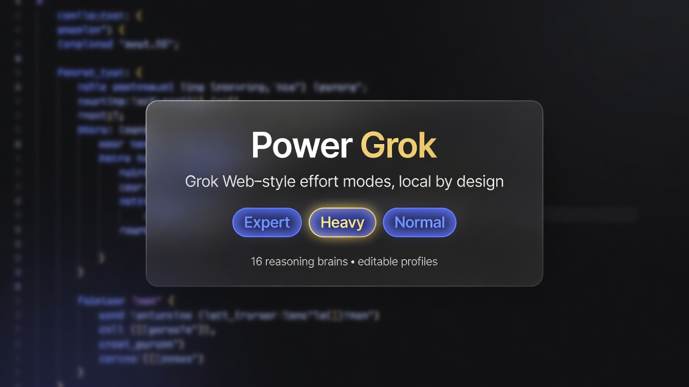

<div align="center">

# Power Grok

**Expert · Heavy · Normal** — session effort modes for a coding agent that
actually sticks with them.



[What it adds](#what-power-grok-adds) ·
[How modes work](#how-expert-heavy-and-normal-work) ·
[Brains](#reasoning-brains) ·
[Try it](#try-it-in-a-session) ·
[Install](#install-side-by-side) ·
[Reference](#reference)

**Command:** `powergrok` ·
**Trunk:** [`powergrok`](https://github.com/zfifteen/powergrok/tree/powergrok) ·
**Upstream:** [xai-org/grok-build](https://github.com/xai-org/grok-build)

</div>

---

## What Power Grok adds

If you use [Grok on the web](https://grok.com), you already know the idea:
sometimes you want a quick answer; sometimes you want the model to **work harder**
before it speaks. Deeper modes feel like a team thinking through the problem.

**Power Grok** brings that **depth idea** (light / deeper / max team) into the
terminal as **local shell modes**: sticky Expert, Heavy, and Normal, with a fixed
team of **brains** on non-trivial work.

It’s a **source-built product line** on top of the
[Grok Build](https://github.com/xai-org/grok-build) agent family (TUI, tools,
edits, shell, MCP, plan mode, headless, ACP), plus first-class effort modes and
an editable roster of reasoning profiles. Install as **`powergrok`** alongside
the official `grok` CLI, with its own home and project tree.

On the **`powergrok` trunk**, Expert / Heavy / Normal and the 16-brain roster
are product features enforced by the shell.

In short: **web-style effort depth, local by design.**

Need the binary first? Jump to [Install](#install-side-by-side).

---

## How Expert, Heavy, and Normal work

Type a slash command. The mode **sticks** for the session. The chrome shows
progress and which brain is active. For **non-trivial** work under Expert or
Heavy, the shell runs a **fixed-size team**. Trivial turns (quick lookups, small
fixes) stay with a single leader even in elevated modes.

| You type | Feel | What happens |
|----------|------|----------------|
| **`/normal`** | Everyday agent | One leader. Fast. Default coding and chat. |
| **`/expert`** | “Think harder with me” | **4 brains** analyze, then the leader synthesizes. Usual sweet spot. |
| **`/heavy`** | “Leave no angle unturned” | **16 brains** (≥1 contrarian-class), then synthesis. Thorough — and **costly / slower**. |

### What the team does during analysis

Under Expert and Heavy, each brain **reads, searches, argues, and returns a
structured report**. Repo writes wait until **after** the leader has synthesized
the team’s work.

Depth first; execution second.

### A typical Expert/Heavy turn

1. You’re already in `/expert` or `/heavy` (sticky — set it once).
2. You ask for something that needs depth (design, audit, hard bug).
3. Power Grok runs the fixed brain team **locally** on your machine.
4. The team finishes (or you abort / take a partial report under the rules).
5. The leader gets a **disagreement-oriented** package: consensus, conflicts,
   unique contributions, residuals, and a decision path.
6. **Then** you can execute — implement, patch, commit — with that synthesis in hand.

Team size and join rules live in the shell ledger.

More detail: [`docs/effort-modes-builtin/`](docs/effort-modes-builtin/).

---

## Reasoning brains

A **brain** is a short, versioned **reasoning protocol**: method, stop rules, the
artifact it must produce, and the kind of delta it contributes on the team.
Expert and Heavy fill their slots from a shared pool of these profiles.

### The simple rules

- There is a pool of **16** built-in brains.
- **Expert** draws a **random 4** of those 16 for each team run (optional seed:
  `GROK_EFFORT_BRAIN_SEED`).
- **Heavy** runs **all 16**, in a fixed order, including at least one
  contrarian-class brain.
- The pool is **user-editable** — protocols, rosters, and optional model pins.

### Built-ins (ids you’ll see in chrome and reports)

| Family | Brains |
|--------|--------|
| Foundations | `first_principles`, `map_territory`, `circle_of_competence` |
| Systems | `systems_loops`, `theory_of_constraints`, `five_whys_root` |
| Consequences | `second_order`, `inversion`, `pre_mortem` |
| Decision quality | `scientific_method`, `bayesian_update`, `fermi_estimate` |
| Adversarial / dialectic | `via_negativa`, `ooda_tempo`, `steelman_dialectic`, `red_team` |

### Make them yours

On first use, Power Grok seeds editable copies under your home:

```text
~/.powergrok/effort-brains/
  catalog.toml
  rosters/expert.toml      # random 4
  rosters/heavy.toml       # all 16, ordered
  brains/*.md              # the actual protocols
```

Project overlay: `<repo>/.powergrok/effort-brains/` (merge-by-id). Invalid config
fails with a clear error so the roster stays intentional.

Optional: per-brain model overrides when `allow_model_overrides = true` in
`catalog.toml`.

Full plan: [`docs/effort-modes-builtin/07-reasoning-brains-implementation-plan.md`](docs/effort-modes-builtin/07-reasoning-brains-implementation-plan.md).

---

## Try it in a session

After [install](#install-side-by-side) puts `powergrok` on your `PATH` (and you’ve
completed product auth under `~/.powergrok`):

```text
powergrok
/expert          # sticky
# … ask for a real design review or audit …

/heavy           # full 16 — expect more time and cost
/normal          # single-leader day-to-day
```

Chrome tracks progress with the active brain id (e.g.
`Expert 2 of 4 · bayesian_update`).

---

## Side-by-side with official `grok`

| Concern | Official | Power Grok |
|---------|----------|------------|
| Command | `grok` | **`powergrok`** |
| User state | `~/.grok` | **`~/.powergrok`** (`GROK_HOME`) |
| Project tree | `<repo>/.grok/` | **`<repo>/.powergrok/`** (when run as `powergrok`) |
| Concurrent use | — | **Supported** |
| Auto-update | product default | **off** in Power Grok seed (source-built install stays put) |

Isolation contract: [`docs/powergrok/BUILD_PLAN.md`](docs/powergrok/BUILD_PLAN.md).  
Empty project layer (`.grok/` present, no `.powergrok/`): **`/bootstrap-project`** (opt-in copy or `--empty`; writes need `--confirm`).  
Naming: “Power Grok” in prose, `powergrok` for binary and paths —
[`docs/powergrok/BRANDING_PLAN.md`](docs/powergrok/BRANDING_PLAN.md).

---

## Reference

Install paths, build flags, layout, and ops. The product story is above; this
half is the conventional README.

### Install (side-by-side)

Official released `grok` installers: [x.ai/cli](https://x.ai/cli).  
**Power Grok** builds from **this repo’s `powergrok` branch**.

| Piece | Path |
|-------|------|
| Wrapper on `PATH` | `~/.local/bin/powergrok` |
| Real binary | `~/.local/lib/powergrok/powergrok` |
| Version stamp | `~/.local/lib/powergrok/VERSION` |
| User home | `~/.powergrok` (`GROK_HOME`) |

**Primary path (one command):**

```sh
git clone https://github.com/zfifteen/powergrok.git
cd powergrok
git checkout powergrok
git pull origin powergrok

./scripts/install-powergrok.sh
# release build + named binary + wrapper + seed config + VERSION

# Ensure ~/.local/bin is on PATH, then:
powergrok --version
powergrok --help
```

Useful flags: `--dry-run`, `--no-build`, `--prefix DIR`, `--grok-home DIR`,
`--status`, `--status --check-freshness`, `--rollback`,
`--uninstall`, `--purge-home`, `--no-install-completions`.  
Full contract: [`docs/powergrok/BUILD_PLAN.md`](docs/powergrok/BUILD_PLAN.md) §9.  
**Lifecycle (upgrade / VERSION / rollback):** [`docs/powergrok/LIFECYCLE.md`](docs/powergrok/LIFECYCLE.md).

```sh
# After day-1 install — upgrade from source:
git pull origin powergrok
./scripts/install-powergrok.sh
./scripts/install-powergrok.sh --status

# Optional advisory (never auto-installs):
./scripts/install-powergrok.sh --status --check-freshness

# Roll back lib binary to previous install:
./scripts/install-powergrok.sh --rollback
```

In-session: **`/install-status`** (alias `/powergrok-status`) shows VERSION identity when running the installed binary.

**Manual steps** (reference only — prefer the installer):

```sh
cargo build -p xai-grok-pager-bin --release --features powergrok

mkdir -p ~/.local/lib/powergrok ~/.local/bin ~/.powergrok
install -m 755 target/release/xai-grok-pager ~/.local/lib/powergrok/powergrok

# Prefer installing the maintained wrapper:
#   ./scripts/install-powergrok.sh --no-build
# Or copy scripts/powergrok.wrapper.sh to ~/.local/bin/powergrok and set
# POWERGROK_LIB / GROK_HOME per BUILD_PLAN §5.2.
```

First launch opens the product browser/account flow under **Power Grok’s home**
(`~/.powergrok`). See
[`crates/codegen/xai-grok-pager/docs/user-guide/02-authentication.md`](crates/codegen/xai-grok-pager/docs/user-guide/02-authentication.md).

Longer install / isolation notes: [`docs/powergrok/BUILD_PLAN.md`](docs/powergrok/BUILD_PLAN.md).

### Building from source

**Requirements**

- **Rust** — pinned by [`rust-toolchain.toml`](rust-toolchain.toml); `rustup` installs on first build
- **protoc** — [`bin/protoc`](bin/protoc) (dotslash) or `protoc` on `PATH` / `$PROTOC`
- macOS and Linux supported; Windows best-effort from this tree

```sh
cargo check -p xai-grok-pager-bin --features powergrok
cargo run -p xai-grok-pager-bin --features powergrok
cargo build -p xai-grok-pager-bin --release --features powergrok
# → target/release/xai-grok-pager
```

Always pass **`--features powergrok`** for Power Grok branding and the product build line.

### Documentation

| Doc | What |
|-----|------|
| [`docs/effort-modes-builtin/`](docs/effort-modes-builtin/) | Expert / Heavy / Normal program (charter → tech spec → plans) |
| [`docs/effort-modes-builtin/07-reasoning-brains-implementation-plan.md`](docs/effort-modes-builtin/07-reasoning-brains-implementation-plan.md) | 16 brains, rosters, config, runtime |
| [`docs/powergrok/BUILD_PLAN.md`](docs/powergrok/BUILD_PLAN.md) | Isolation + install contract |
| [`docs/powergrok/BRANDING_PLAN.md`](docs/powergrok/BRANDING_PLAN.md) | “Power Grok” (prose) vs `powergrok` (binary/paths) |
| [`AGENTS.md`](AGENTS.md) | Branch discipline (`main` intake vs `powergrok` trunk) |
| Pager user guide | [`crates/codegen/xai-grok-pager/docs/user-guide/`](crates/codegen/xai-grok-pager/docs/user-guide/) |
| Upstream docs | [docs.x.ai/build](https://docs.x.ai/build/overview) |

### Repository layout

| Path | Contents |
|------|----------|
| `crates/codegen/xai-grok-pager-bin` | Binary composition root (`xai-grok-pager`) |
| `crates/codegen/xai-grok-pager` | TUI + Power Grok chrome |
| `crates/codegen/xai-grok-shell` | Agent runtime; **effort modes + brains** under `session/` |
| `crates/codegen/xai-grok-tools` | Tools (terminal, edit, search, …) |
| `crates/codegen/xai-grok-workspace` | Filesystem, VCS, execution, checkpoints |
| `crates/codegen/xai-grok-config` | Paths, branding adapter, config |
| `docs/effort-modes-builtin/` | Effort mode + brains program docs |
| `docs/powergrok/` | Fork product contracts + README assets |
| `third_party/` | Vendored upstream source |

> [!IMPORTANT]
> Root `Cargo.toml` is **generated** — treat as read-only. Prefer editing per-crate `Cargo.toml` files.

#### Effort / brains code map

| Module | Role |
|--------|------|
| `session::effort_mode` | Sticky modes, ledgers, gates, chrome, team briefs |
| `session::effort_brains` | Catalog load/validate, select, prompt, seed export |
| `session::effort_team` | Shell-owned brain spawn / join |

### Development

```sh
cargo check -p <crate> --features powergrok
cargo test -p xai-grok-shell --test effort_brains_load
cargo test -p xai-grok-config
cargo clippy -p <crate>
cargo fmt --all
```

### Branch model

| Branch | Role |
|--------|------|
| **`main`** | Upstream intake (`xai-org/grok-build`) |
| **`powergrok`** | **Product trunk** — GitHub default; builds ship from here |
| **`feat/*`** | Feature work; open PRs **into `powergrok`** |

Details: [`AGENTS.md`](AGENTS.md).

### Power-user knobs (optional)

| Knob | Purpose |
|------|---------|
| `GROK_HOME` | Defaults to `~/.powergrok` via wrapper |
| `POWERGROK_BRANDING=1` | Optional branding override for **non-feature** builds/tests only; product builds use `--features powergrok` (always-on). The install wrapper does **not** export this. |
| `GROK_EFFORT_BRAIN_SEED` | Deterministic Expert brain draw (tests / repro) |

### Contributing

Operator fork. See [`CONTRIBUTING.md`](CONTRIBUTING.md) for inherited notices.  
Power Grok features should target **`powergrok`** as the PR base.

### License

First-party code: **Apache License, Version 2.0** — [`LICENSE`](LICENSE).

Third-party / vendored code retains original licenses:

- [`THIRD-PARTY-NOTICES`](THIRD-PARTY-NOTICES)
- [`crates/codegen/xai-grok-tools/THIRD_PARTY_NOTICES.md`](crates/codegen/xai-grok-tools/THIRD_PARTY_NOTICES.md)
- [`third_party/NOTICE`](third_party/NOTICE)
